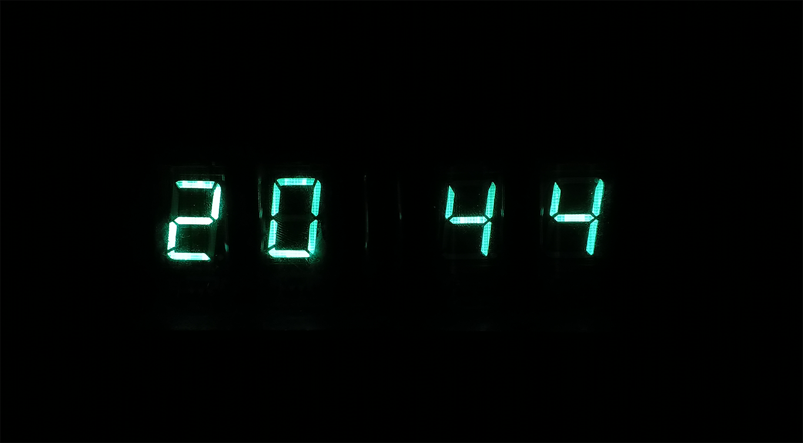
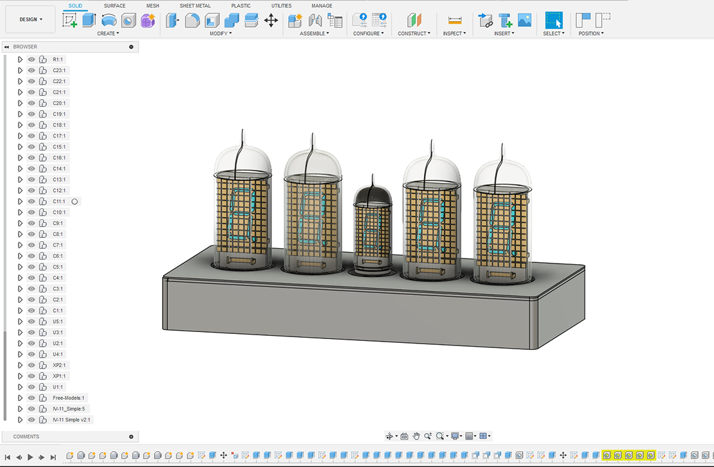

# Ретро-часы на вакуумных люминесцентных индикаторах ИВ-11 и ИВ-6

Стильные настольные часы с винтажными советскими ВЛИ (вакуумными люминесцентными индикаторами) ИВ-11 и ИВ-6 на современной элементной базе STM32.

Мягкое зелёное свечение, минимум деталей и максимум атмосферы.

## ✨ Особенности

- Используются редкие винтажные индикаторы ИВ-11 и ИВ-6
- Управление на **STM32F401CC** (Black Pill) со встроенным RTC
- Питание от USB Type-C (5 В)
- Высоковольтный драйвер TD62783AP / KID65783AP
- Повышающий DC-DC XL6009 (~50 В) и понижающий MP2307 (1,5 В накал)
- Одна кнопка управления (короткое нажатие / длинное нажатие)
- Полностью открытый проект: схема, плата, прошивка, корпус

## 📸 Галерея

         

## 🛠 Что нужно для сборки

### Компоненты
- STM32F401CC Black Pill
- Индикаторы ИВ-11 (2 шт.) + ИВ-6 (по желанию)
- XL6009 (повышающий)
- MP2307 (понижающий)
- TD62783AP или KID65783AP
- USB Type-C разъём, кнопка, пассивные компоненты

**Полный BOM** — в файле `BOM.xlsx` (или в папке docs).

### Инструменты
- Altium Designer (или KiCad — если переделаешь)
- STM32 ST-LINK Utility
- 3D-принтер для корпуса (модель в Fusion 360)

## 📥 Как собрать

1. Скачай Gerber-файлы и закажи плату (например, на JLCPCB или PCBWay).
2. Купи компоненты (ссылки ниже).
3. Запаяй по порядку: DC-DC → проверка напряжений → STM32 (с уже прошитой прошивкой) → индикаторы.
4. Прошей микроконтроллер (см. инструкцию ниже).
5. Распечатай корпус и собери.

## ⚡ Прошивка через STM32 ST-LINK Utility

Подробная пошаговая инструкция (скопируй из своей статьи):

1. Скачай и установи **STM32 ST-LINK Utility**.
2. Подключи ST-Link к Black Pill (SWDIO, SWCLK, GND, 3.3V).
3. Питай плату по USB Type-C.
4. `Target → Connect`
5. `File → Open file…` → выбери `.hex`
6. `Target → Program & Verify` → Start

Подробности и скриншоты — в папке `firmware`.

## 📁 Структура репозитория
