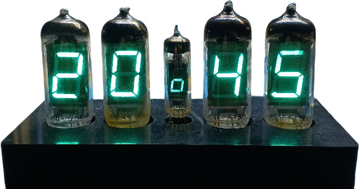
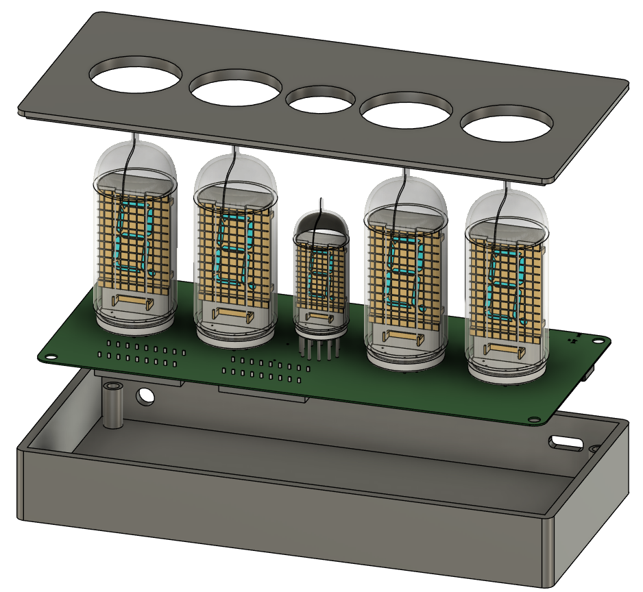
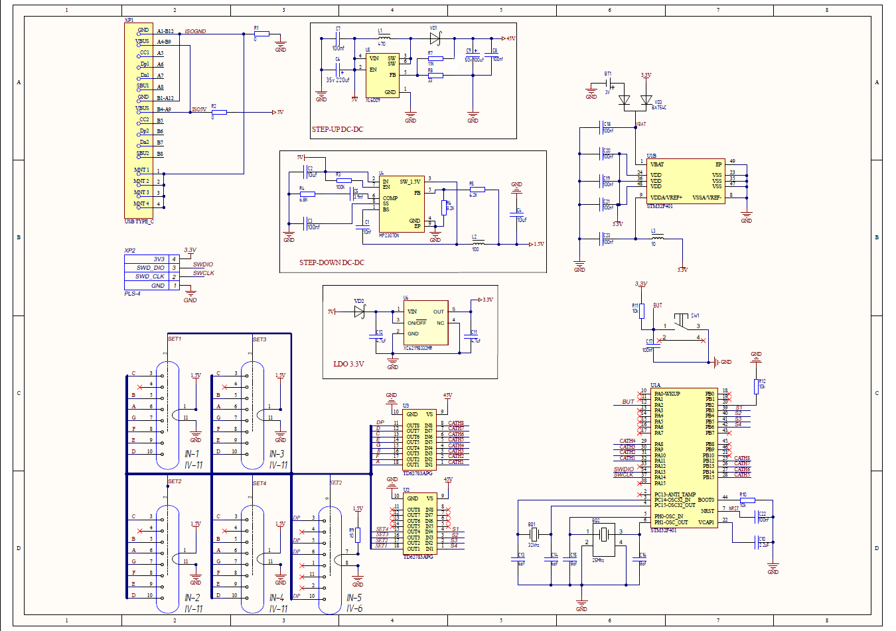

# Ретро-часы на вакуумных люминесцентных индикаторах ИВ-11 и ИВ-6

Стильные настольные часы с винтажными советскими ВЛИ (вакуумными люминесцентными индикаторами) ИВ-11 и ИВ-6 на современной элементной базе STM32.

Мягкое зелёное свечение, минимум деталей и максимум атмосферы.

## ✨ Описание проекта
Настольные ретро-часы собраны на советских вакуумных люминесцентных индикаторах:
- ИВ-11 — 4 штуки (отображение часов и минут)
- ИВ-6 — 1 штука (мигающая разделительная точка)

Для корректной работы ламп используются два импульсных преобразователя напряжения:
- XL6009 (повышающий) — формирует анодное напряжение ≈ 45 В
- MP2307 (понижающий) — обеспечивает напряжение накала 1,5 В
  
В качестве основного контроллера применяется плата STM32F411 Black Pill.
Индикаторы управляются через высоковольтный драйвер верхнего ключа TD62783AP (или его китайский аналог KID65783AP).

Настройка времени осуществляется одной кнопкой:
- Короткое нажатие —  установка минут
- Длительное нажатие —  установка часов

## ✨ Особенности

- Используются редкие винтажные индикаторы ИВ-11 и ИВ-6
- При отключении питания время не сбрасывается
- Питание от современного разъема USB Type-C (5 В)
- Не нужно мотать трансформатор
- Одна кнопка управления (короткое нажатие / длинное нажатие)
- Полностью открытый проект: схема, плата, прошивка, корпус

## ✨ Корпус

Корпус выполнен с помощью программы Fusion 360, расспечатныый на 3D принтаре

## 📸 Схема

         
## 🛠 Что нужно для сборки

### Компоненты
- STM32F401CC Black Pill
- Индикаторы ИВ-11 (4 шт.) + ИВ-6 (1 шт.)
- XL6009 (повышающий)
- MP2307 (понижающий)
- TD62783AP или KID65783AP
- Кнопка, пассивные компоненты

**Полный BOM** — в файле `BOM.xlsx` (папке docs).

### Инструменты
- Altium Designer (если переделывать)
- STM32 ST-LINK Utility
- 3D-принтер для корпуса (модель в Fusion 360)
